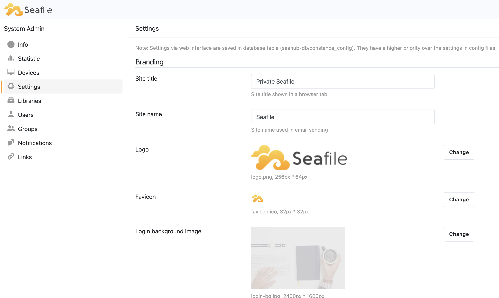

# Server Configuration and Customization

## Config Files

The config files used in Seafile include:

* [environment variables](.env.md): contains environment variables, the items here are shared between different components.
* [ccnet.conf](ccnet-conf.md): contains some settings for connection to ccnet_db.
* [seafile.conf](seafile-conf.md): contains settings for seafile daemon and fileserver.
* [seahub_settings.py](seahub_settings_py.md): contains settings for Seahub
* [seafevents.conf](seafevents-conf.md): contains settings for background tasks and file search.

You can also modify most of the config items via web interface.The config items are saved in database table (seahub-db/constance_config). They have a higher priority over the items in config files.

## The design of configure options

There are now three places you can config Seafile server:

- environment variables
- config files
- via web interface

Environment variables also have three categories:

- Initialization variables that used to generate config files when Seafile server run for the first time.
- Variables that shared and used by multiple components of Seafile server.
- Variables that used both in generate config files and later also needed for some components that have no corresponding config file.

The variables in the first category can be deleted after initialization. In the future, we will make more components can read config from environment variables, so that the third category is no longer needed.

The web interface has the highest priority, then the environment variables, then the config files. In practise, you can disable settings via web interface for simplicity.

