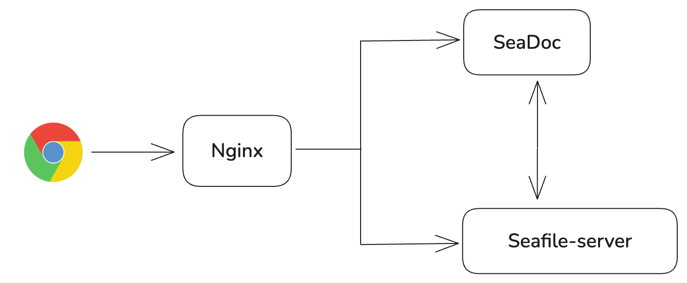

# SeaDoc Integration

SeaDoc is an extension of Seafile that providing an online collaborative document editor.

SeaDoc designed around the following key ideas:

* An expressive easy to use editor
* A review and approval workflow to better control how contents changes
* Inter-document linking for connecting related contents
* AI integration that streamlines content generation, summarization, and management
* Comprehensive APIs for automating document generating and processing

SeaDoc excels at:

* Authoring product and technical documents
* Creating knowledge base articles and online manuals
* Building internal Wikis

## Architecture

The SeaDoc archticture is demonstrated as below:



Here is the workflow when a user open sdoc file in browser

1. When a user open a sdoc file in the browser, a file loading request will be sent to Caddy, and Caddy proxy the request to SeaDoc server (see [Seafile instance archticture](../setup/overview.md) for the details).
2. SeaDoc server will send the file's content back if it is already cached, otherwise SeaDoc serve will sends a request to Seafile server.
3. Seafile server loads the content, then sends it to SeaDoc server and write it to the cache at the same time.
4. After SeaDoc receives the content, it will be sent to the browser.

## Setup SeaDoc

> Seafile version 11.0 or later is required to work with SeaDoc.

### Deployment method

SeaDoc has the following deployment methods:

- [SeaDoc and Seafile docker are deployed on the same host](#seadoc-and-seafile-docker-are-deployed-on-the-same-host).
- [Deploy SeaDoc on a new host](#deploy-seadoc-on-a-new-host).

### SeaDoc and Seafile docker are deployed on the same host

#### Download the seadoc.yml and integrate SeaDoc in Seafile docker

```shell
# for community edition
wget https://manual.seafile.com/12.0/docker/ce/seadoc.yml

# for pro edition
wget https://manual.seafile.com/12.0/docker/pro/seadoc.yml
```

Modify `.env`, and insert `seadoc.yml` into `COMPOSE_FILE`, and enable SeaDoc server

```shell
COMPOSE_FILE='seafile-server.yml,caddy.yml,seadoc.yml'

ENABLE_SEADOC=false
SEADOC_SERVER_URL=https://example.seafile.com/sdoc-server
```

#### Create the SeaDoc database manually

SeaDoc and Seafile share the MySQL service.

Create the database sdoc_db in Seafile MySQL.

```sh
create database if not exists sdoc_db charset utf8mb4;
GRANT ALL PRIVILEGES ON `sdoc_db`.* to `seafile`@`%.%.%.%`;
```

Note, SeaDoc will only create one database table to store operation logs.


### Deploy SeaDoc on a new host

#### Download and modify seadoc.yml

Download [seadoc.yml](../docker/seadoc/1.0/standalone/seadoc.yml) sample file to your host. Then modify the file according to your environment. The following fields are needed to be modified:

- `DB_HOST`: MySQL host
- `DB_PORT`: MySQL port
- `DB_USER`: MySQL user
- `DB_PASSWD`: MySQL password
- `volumes`: The volume directory of SeaDoc data
- `SDOC_SERVER_HOSTNAME`: SeaDoc service URL
- `SEAHUB_SERVICE_URL`: Seafile service URL

#### Create the SeaDoc database manually

SeaDoc and Seafile share the MySQL service.

Create the database sdoc_db in Seafile MySQL and authorize the user.

```sh
create database if not exists sdoc_db charset utf8mb4;
GRANT ALL PRIVILEGES ON `sdoc_db`.* to `seafile`@`%.%.%.%`;
```

Note, SeaDoc will only create one database table to store operation logs.

Then follow the section: Start SeaDoc.


## Start SeaDoc

Start SeaDoc server with the following command

```sh
docker compose up -d
```

Now you can use SeaDoc!

## SeaDoc directory structure

### `/opt/seadoc-data`

Placeholder spot for shared volumes. You may elect to store certain persistent information outside of a container, in our case we keep various log files and upload directory outside. This allows you to rebuild containers easily without losing important information.

* /opt/seadoc-data/sdoc-server: This is the directory for SeaDoc server configuration and data.
* /opt/seadoc-data/nginx-logs: This is the directory for nginx logs.
* /opt/seadoc-data/ssl: This is directory for certificate, which does not exist by default.

## FAQ

### About SSL

From Seafile 12.0, the SSL is handled by [***Caddy***](https://caddyserver.com/docs/). Caddy is a modern open source web server that mainly binds external traffic and internal services in [seafile docker](../setup/overview.md). The default caddy image is [`lucaslorentz/caddy-docker-proxy:2.9`](https://github.com/lucaslorentz/caddy-docker-proxy), which user only needs to correctly configure the following fields in `.env` to automatically complete the acquisition and update of the certificate:

```shell
SEAFILE_SERVER_PROTOCOL=https
SEAFILE_SERVER_HOSTNAME=example.com
```
